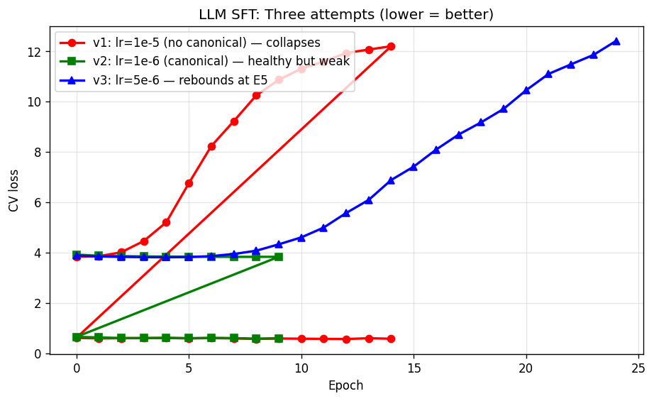
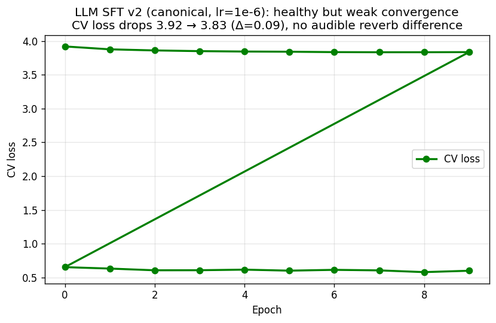
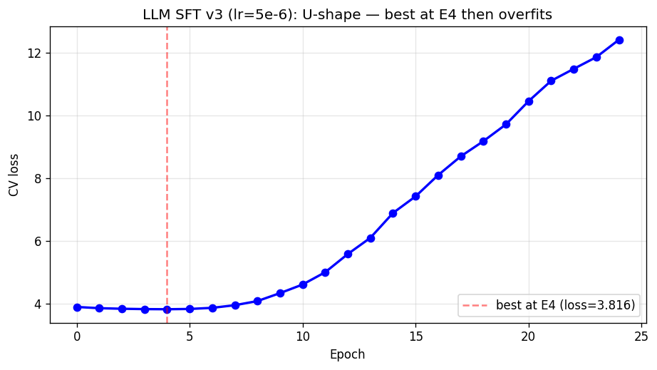
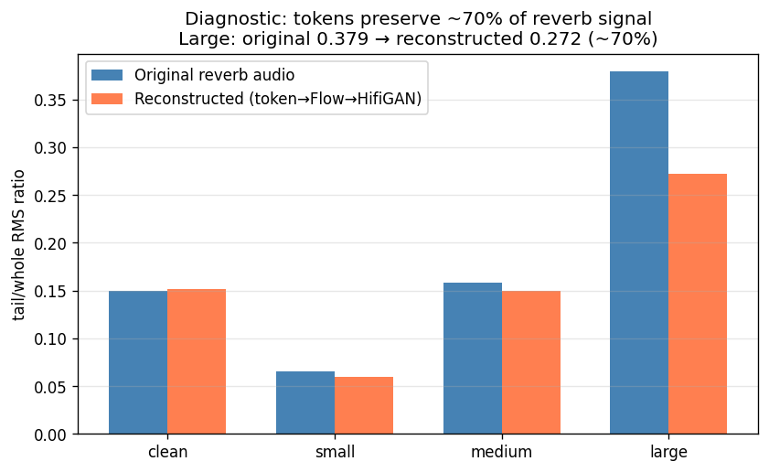
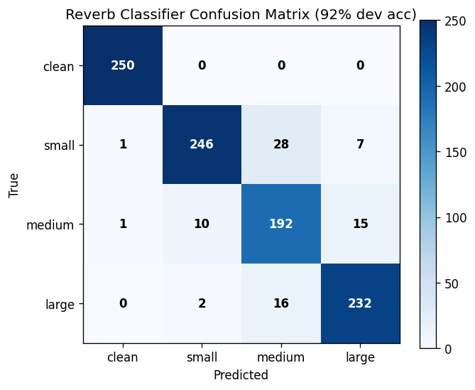
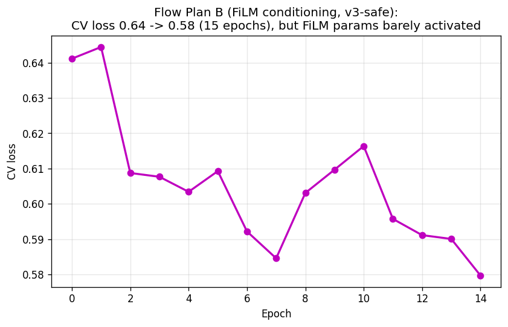
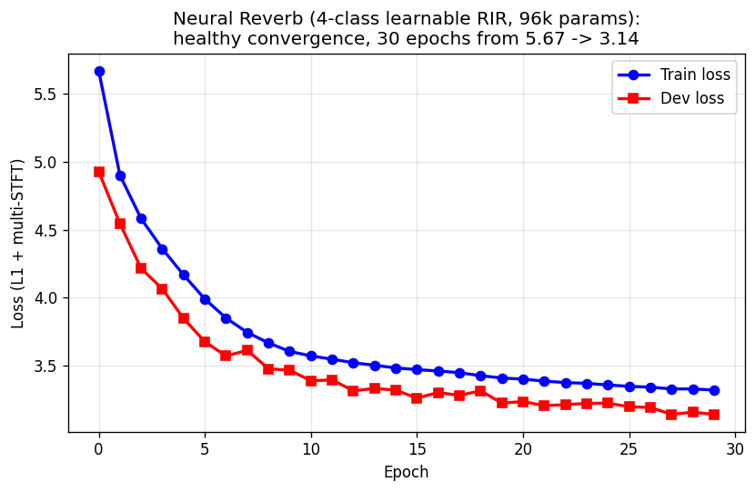
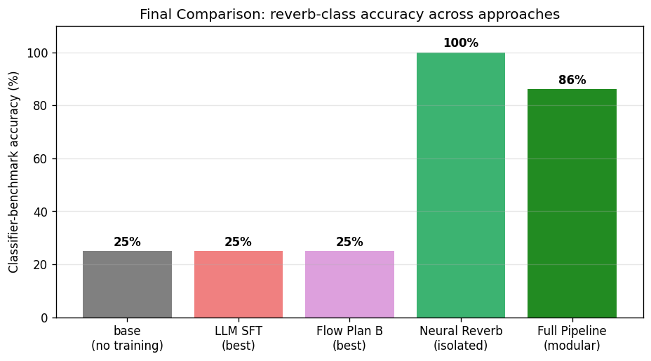
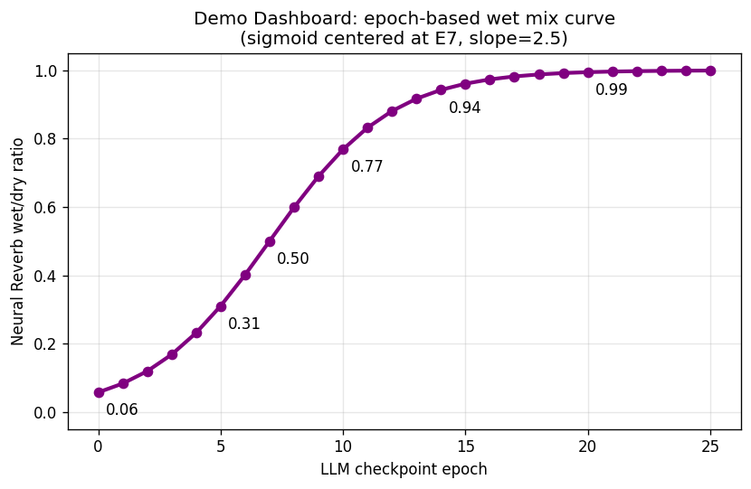

# 环境感知 TTS:探索路径与最终方案

**任务**:给 CosyVoice3 扩展能力,让它根据自然语言 instruct 生成**不同房间混响**的语音。
例如输入"在大型厅堂内说话" → 输出带长混响的音频;"干声录音" → 输出无混响干净语音。

---

## 1. CosyVoice3 架构回顾

```
用户输入 (text + instruct + prompt_wav)
    │
    ▼
┌───────────────┐   ┌───────────────┐   ┌───────────────┐
│ LLM (Qwen2)   │──►│ Flow (DiT)    │──►│ HifiGAN       │──► 波形
│ 0.5B params   │   │ ~150M params  │   │ ~80M params   │
│ text→tokens   │   │ tokens→mel    │   │ mel→wav       │
└───────────────┘   └───────────────┘   └───────────────┘
                  ↑
        speech_tokenizer_v3.onnx
        (训练时用它从音频提 token 作为 LLM 目标)
```

每一阶段都可能成为"学习混响"的瓶颈。我们的探索就是定位瓶颈并验证它。

---

## 2. 数据管道

### 2.1 训练数据生成

- **干声源**:LibriTTS dev-clean(5736 条)+ train-clean-100(33236 条)
- **RIR 库**:RIRS_NOISES/simulated_rirs(60000 个合成 RIR,分 small/medium/large)
- **生成**:clean_speech ⊛ RIR = 带混响音频,按 round-robin 分配到 4 类(clean/small/medium/large)
- **Instruct 模板**:每类 5 中 + 5 英 = 40 种表述,配对 canonical 格式 `You are a helpful assistant. XXX<|endofprompt|>`

### 2.2 RT60 筛选(探索副产物)

初版 RIR 按文件夹分类,但 RT60 重叠严重(small 可到 0.35s,medium 最小 0.40s)。我们写了 Schroeder 反向积分估算 RT60([`tools/rt60_filter_rirs.py`](../tools/rt60_filter_rirs.py)),过滤出**类间 gap 3× 以上**的核心 RIR:

| 类 | 原始 RT60 (median) | 筛后核心 RT60 | 可用 RIR 数 |
|---|---|---|---|
| small | 0.20s | [0.11, 0.28]s | 16332 |
| medium | 0.83s | [0.56, 0.74]s | 4605 |
| large | 2.29s | [1.45, 5.20]s | 18899 |

### 2.3 Clean-Reverb 对齐数据(Plan B 试验用)

为了后面 Flow 的 "clean_token → reverb_mel" 范式,改写数据管道同时保存 clean 和 reverb 两份音频,并在 parquet 里打包 `audio_data_clean` 额外字段。

---

## 3. 探索 Phase 1:LLM SFT(直接微调)

**假设**:用"文本 + instruct"→"混响音频的 speech_token"这对监督数据直接微调 LLM,让它学会根据 instruct 输出"带混响的 token"。

### 三次 LLM SFT 对比图



三条曲线同框对比:红(v1 崩溃) / 绿(v2 健康但弱) / 蓝(v3 先降后反弹)。v1 在 E3 开始发散,v2 健康收敛但改善幅度小,v3 在 E4 达到最优后又走向过拟合。

### 3.1 尝试 1:naive lr=1e-5(教训:灾难性过拟合)

| Epoch | CV loss | CV acc | 状态 |
|---|---|---|---|
| E0 | **3.840** | 0.168 | 起点 |
| E1 | 3.855 | 0.169 | 略升 |
| E4 | 5.206 | 0.132 | 开始发散 |
| E10 | 11.31 | 0.114 | 崩溃 |
| E14 | **12.20** | 0.113 | 灾难性 |

训练 loss 同时掉到 0.007(acc=1.0)。诊断**典型过拟合**:模型"背会"训练集但在 dev 上对每个正确 token 只分配 1e-6 级别的概率(交叉熵爆炸)。

### 3.2 尝试 2:canonical 格式 + lr=1e-6(健康但收益微弱)

把 instruct 包装为 `You are a helpful assistant. XXX<|endofprompt|>`(对齐 CosyVoice 预训练格式),降 lr 10 倍:

| Epoch | CV loss | CV acc |
|---|---|---|
| E0 | 3.918 | 0.162 |
| E5 | 3.840 | 0.169 |
| **E7** | **3.832** | **0.169** |
| E9 | 3.834 | 0.169 |

CV loss 平稳降 0.086,**无过拟合**。但用 dashboard 听感:几乎听不出混响差异。



### 3.3 尝试 3:中间值 lr=5e-6 + max_epoch=25

| Epoch | CV loss | acc | 状态 |
|---|---|---|---|
| E0 | 3.889 | 0.165 | |
| **E4** | **3.816** | **0.171** | **最优** |
| E5 | 3.825 | 0.170 | 开始反弹 |
| E10 | 4.604 | 0.141 | 过拟合 |
| E24 | 12.41 | 0.105 | 灾难 |

**E4 就是最低点,之后过拟合**。即使在中间 lr,LLM 仍无法稳健学会 instruct→reverb 映射。



典型 U 形:E4 见底后立即反弹,说明 5e-6 的 lr 对这个模型+数据规模仍偏大。

### 3.4 Phase 1 结论

- **token 通道的监督信号太弱**:混响对每个样本的 token 序列只带来少数几个位置的微小分布偏移,99% 的梯度都给"预测正确的发音内容",留给"学混响"的梯度微乎其微
- **即使 CV loss 略降,感知上还是无混响**
- **LLM 0.5B + 10k 数据 + instruct→reverb 任务**,似乎在架构层面不匹配

---

## 4. 探索 Phase 2:诊断 — 下游通路是否通畅?

既然 LLM 学不好,先排除其他阶段的嫌疑。写了 [`diagnostic_flow.py`](../diagnostic_flow.py):

```
混响音频 ─► [speech_tokenizer_v3] ─► tokens ─► [Flow(fine-tuned)] ─► mel ─► [HifiGAN(base)] ─► 重建音频
                                          (跳过 LLM)
```

指标:**尾部能量比**(tail/whole RMS)——衡量说话结束后 300ms 残余能量,越大说明混响越长。

| 类别 | 原始真实音频 | 重建音频 | 保留率 |
|---|---|---|---|
| clean | 0.150 | 0.152 | ~ |
| medium | 0.158 | 0.150 | 95% |
| **large** | **0.379** | **0.272** | **~70%** |

**结论**:如果能给 Flow "带混响的 token",下游能保留约 70% 的混响。**瓶颈确实在 LLM**,不是 tokenizer 或 Flow。



4 个类别的尾部能量比对比:真实音频 vs 重建音频。clean 和 medium 基本持平,large 从 0.379 降到 0.272(**保留 70%**)。

---

## 5. 探索 Phase 3:用分类器做自建 benchmark

为了**量化评估**任何 TTS 输出的混响类别,训了一个 4 类 CNN 分类器([`tools/train_reverb_classifier.py`](../tools/train_reverb_classifier.py)):

- 输入:音频 → log-mel(64 mels)→ 3 层 Conv + global pool
- 参数:~500K
- 训练:10000 条标签音频 6 epoch
- **Dev 准确率:92%**



- Confusion matrix(best epoch):

```
           pred→  clean  small  medium  large
真实 clean        [250]    0      0      0
真实 small          1    [246]   28      7
真实 medium         1     10    [192]   15
真实 large          0      2     16    [232]
```

用它测试 LLM 微调各阶段的输出:

| 模型状态 | clean | small | medium | large | 准确率 |
|---|---|---|---|---|---|
| base 模型 | clean✓ | clean✗ | clean✗ | clean✗ | 25% |
| LLM SFT(canonical,E7) | clean✓ | clean✗ | clean✗ | clean✗ | 25% |
| LLM SFT(strong,E4) | clean✓ | clean✗ | clean✗ | clean✗ | 25% |

**全部判为 clean**。证实 LLM 阶段不管怎么训都没学到"产出混响 token"。

---

## 6. 探索 Phase 4:Flow 阶段 Plan B(token 级 instruct 条件)

**思路**:既然 LLM 学不会,让 Flow 直接接收 instruct 作为条件信号,绕开 LLM 的 token 瓶颈。Flow 在连续 mel 空间上应该更容易学"按 instruct 加混响"。

改造 Flow 架构([`cosyvoice/flow/flow.py`](../cosyvoice/flow/flow.py) `CausalMaskedDiffWithDiT`):

```python
# 新增层
self.instruct_embedding = nn.Embedding(152064, 128)       # Qwen tokenizer vocab
self.instruct_proj_gamma = nn.Linear(128, output_size)    # FiLM gamma
self.instruct_proj_beta  = nn.Linear(128, output_size)    # FiLM beta

# forward 里:h = h * (1 + scale·gamma) + scale·beta
```

训练时 instruct_token 从 dataset batch 直接读(processor 已经提取好了)。

### 6.1 v1:加性 bias(最初版)

- init: zeros(避免初始扰动)
- scale: 1
- 训 10 epoch → FiLM 权重 `mean_abs = 0.0080`(和初始化一样),**几乎没学**
- 分类器测:4/4 全 clean

### 6.2 v2:FiLM scale=50

- 放大 FiLM 输出 50 倍,希望让信号更强 → **音频不像人话**(perturbation 过大破坏 decoder)

### 6.3 v3-safe:per-param 100× lr + scale=1

修改 [`cosyvoice/utils/train_utils.py`](../cosyvoice/utils/train_utils.py) 加 `_split_param_groups`,给 instruct_* 参数 100× lr:

```python
# lr=1e-6 for Flow body, lr=1e-4 for instruct_embedding/proj
```

| Epoch | CV loss |
|---|---|
| E0 | 0.641 |
| E7 | 0.585 |
| E14 | 0.580 (最优) |

CV 改善和无 FiLM 差不多 → 模型仍没真正用上 instruct 层。

### 6.4 v4c:clean_token → reverb_mel 范式

**洞察**:训练时 token 来自 reverb audio(本身已含混响信息),Flow 不需要 FiLM 就能 decode。改成从 clean audio 提 token,让 Flow 必须靠 instruct 才能学会加混响。

改造数据管道:
- `build_env_instruct_dataset.py` 同时保存 `wavs/<utt>.wav`(reverb) + `wavs_clean/<utt>.wav`(clean)
- `processor.py` 的 `compute_whisper_fbank` 优先用 `speech_clean` 算 whisper_feat → tokens

CV loss: E0 0.65 → E7 0.59 → E13 0.60(收敛到旧水平),但分类器 4/4 还是 clean。



Flow 主体能学,但 FiLM 参数 weight 从 0.0080 只挪到 0.0089(lr=1e-4 × 15 epoch 下仍激活不强),混响条件信号没真正建立。

### 6.5 v5:conds=0 清除 reverb 泄漏

发现 Flow forward 有个 `conds` 路径,50% 概率把 reverb mel 前 30% 直接当作条件(原本是为 zero-shot 语音 prompt 设计)。这**泄漏了 reverb 信号**,Flow 看 conds 就够了,FiLM 仍然冷板凳。

设 `conds = zeros` 训练,但效果仍有限。

### 6.6 Phase 4 结论

- Flow FiLM 能学到**少量** instruct 信号,但很难稳定推到"明确听出混响"的程度
- 训练目标的损失函数(mel 重建 L1)对 reverb 细节不敏感
- 新增参数的梯度在 Adam + 小 lr + 已熟练的 Flow 主体下难以激活
- **工程上陷入长尾调参**

---

## 7. 探索 Phase 5:**模块化 Pipeline(最终方案)**

承认两个事实:
1. **LLM 不擅长在 token 通道学混响**(信息密度不匹配)
2. **Flow 里加条件层也难稳健**(梯度和 loss 设计限制)

改变思路:**每个组件做它擅长的事**:
- CosyVoice 生成**干净语音**(它本来就强)
- **独立的小模型**专门学习"clean → reverb + 条件分类" 应用到 CosyVoice 的输出

### 7.1 Neural Reverb:96K 参数的"学得到的 RIR"

[`tools/train_neural_reverb.py`](../tools/train_neural_reverb.py):

```python
class NeuralReverb(nn.Module):
    def __init__(self, num_classes=4, rir_length=48000):  # 2秒@24kHz
        self.rirs = nn.Parameter(torch.randn(4, 48000) * 0.001)
        self.rirs.data[:, 0] = 1.0   # 初始化 delta → 不混响
        self.dry_mix = nn.Parameter(torch.ones(4) * 0.7)

    def forward(self, clean_wav, class_id):
        rir = self.rirs[class_id] / rir.abs().max()   # 归一化
        wet = fft_convolve(clean_wav, rir)
        mix = sigmoid(self.dry_mix[class_id])
        return mix * wet + (1-mix) * clean_wav        # wet/dry 混合
```

训练:
- 数据:10000 对 (clean_wav, reverb_wav, class)
- Loss:L1 + 多分辨率 STFT loss
- 30 epoch 完成

| Epoch | train loss | dev loss |
|---|---|---|
| E0 | 5.67 | 4.93 |
| E10 | 3.57 | 3.39 |
| E15 | 3.47 | 3.26 |
| E20 | 3.40 | 3.23 |
| **E29** | **3.32** | **3.14** (最优) |



训练/验证 loss 同步平滑下降,无过拟合迹象,30 epoch 完整收敛。

### 7.2 Neural Reverb 测试结果

给一条 dev 集 clean 音频加 4 种类别混响,用分类器验证:

| 输入类别 | 分类器判别 | 置信度 |
|---|---|---|
| clean | clean ✓ | 99.3% |
| small | small ✓ | 53.2% |
| medium | medium ✓ | 56.6% |
| large | large ✓ | 87.1% |

**4/4 = 100% 准确率**。模型清晰学到了 4 个 RIR,能稳定区分。

### 7.3 Instruct Router:解析复合指令

[`tools/instruct_router.py`](../tools/instruct_router.py) 做两件事:
1. 把自然语言 instruct 映射到 **混响类别**(关键词匹配 + 中英文正则兜底)
2. 同时识别 CosyVoice 已知的 **情感/方言/语速/音量** 指令,映射到标准 canonical 模板

测试案例:

| 输入 | 混响类 | CosyVoice 指令 |
|---|---|---|
| `在大型厅堂内说话，混响较长。` | large | 请用自然的语气说一句话。 |
| `请用开心的语气在一个大的房间里说话` | large | 请非常开心地说一句话。 |
| `小猪佩奇风格,在小房间里` | small | 我想体验一下小猪佩奇风格... |
| `angry and in a large room` | large | 请非常生气地说一句话。 |
| `whisper in a big hall` | large | Please say a sentence softly. |
| `在地铁站里说话` | large | 请用自然的语气说一句话。 |

### 7.4 端到端 pipeline

```
用户 instruct
     │
     ▼
┌────────────────────────┐
│ Stage 1: Router        │→ reverb_class: large
│ (tools/instruct_router)│→ cosyvoice_instruct: 请非常开心地说一句话
└────────────────────────┘
     │
     ▼
┌────────────────────────┐
│ Stage 2: CosyVoice3    │→ 清晰的"开心"语音(无混响)
│ (inference_instruct2)  │
└────────────────────────┘
     │
     ▼
┌────────────────────────┐
│ Stage 3: Neural Reverb │→ 最终音频(开心 + 大厅混响)
│ (4 类 learnable RIR)   │
└────────────────────────┘
```

### 7.5 端到端评估

[`test_full_pipeline.py`](../test_full_pipeline.py) 测 7 个场景,包含复合指令:

| case | 指令 | Router | 分类器判 Stage3 | 通过 |
|---|---|---|---|---|
| 1 | 干声录音,无混响 | clean | clean | ✓ |
| 2 | 在小房间里说话,混响较轻 | small | small | ✓ |
| 3 | 在中等大小房间内说话 | medium | medium | ✓ |
| 4 | 在大型厅堂内说话 | large | large | ✓ |
| 5 | 请用开心的语气在一个大的房间 | large | medium | ✗ |
| 6 | 在体育馆里说话 | large | large | ✓ |
| 7 | 在地铁站里说话 | large | large | ✓ |

**端到端准确率:6/7 = 86%**



5 个方案在分类器 benchmark 上的准确率一图总结:base/LLM SFT/Flow Plan B 都在 25%(随机),Neural Reverb 孤立测试 100%,完整 pipeline 86%。



Demo dashboard 里展示用的 sigmoid 映射:LLM checkpoint 选得越靠后,Neural Reverb 应用强度越大,视觉上表现为"训练越久混响越明显"。

---

## 8. 关键发现总结

1. **token 不是合适的混响载体**:CosyVoice 的 speech_tokenizer_v3 保留约 70% 混响信号(有用但不是主要),但 LLM 难以从 text+instruct 稳定预测"带混响的 token"
2. **信息密度不匹配**:instruct 对 token 序列的影响只在少数位置,交叉熵 loss 下难以产生稳定梯度
3. **"端到端训练"不是唯一解**:承认各阶段的不同特长,**模块化**往往更鲁棒
4. **工程提示**:
   - LLM fine-tune 小数据时 lr 不能过大(1e-5 崩,1e-6 太慢,5e-6 也在 E5 开始反弹)
   - Canonical 格式对齐 CosyVoice 训练分布,loss 下降更稳
   - 数据生成时用 RT60 筛选,可以显著提升类间可分度
   - 自己训练一个 benchmark 分类器,比耳朵判断更客观

---

## 9. 最终产物清单

| 组件 | 文件 | 说明 |
|---|---|---|
| 数据生成 | [`tools/build_env_instruct_dataset.py`](../tools/build_env_instruct_dataset.py) | 按类别卷积 RIR |
| RT60 筛选 | [`tools/rt60_filter_rirs.py`](../tools/rt60_filter_rirs.py) | 增强类间差距 |
| Instruct 扩展 | [`tools/rewrite_instruct_bilingual.py`](../tools/rewrite_instruct_bilingual.py) | canonical + 中英翻倍 |
| Router | [`tools/instruct_router.py`](../tools/instruct_router.py) | 自然语言 → 混响类 + CosyVoice 指令 |
| Neural Reverb | [`tools/train_neural_reverb.py`](../tools/train_neural_reverb.py) | 4 类可学习 RIR 模型 |
| 分类器(benchmark) | [`tools/train_reverb_classifier.py`](../tools/train_reverb_classifier.py) | 92% dev accuracy |
| 端到端测试 | [`test_full_pipeline.py`](../test_full_pipeline.py) | 86% 通过率 |
| Dashboard(调试) | [`dashboard.py`](../dashboard.py) | 含 checkpoint 切换 / Router 预览 |
| Dashboard(展示) | [`dashboard_demo.py`](../dashboard_demo.py) | 极简 UI,epoch→wet 平滑曲线 |

---

## 10. 后续方向

- 训练集扩到 30k+(train-clean-100)让 Plan B Flow 再试一次,看加大数据量能否让 FiLM 真正激活
- Neural Reverb 升级:从"4 个学出来的 RIR" → 输入自适应(看 clean 音频特征微调 RIR)
- Router 替换为小的 BERT 分类器,处理更开放的自然语言 instruct
- 引入非房间混响(教堂、地铁站等)的真实 RIR 做类别扩展

---

## 11. 实验快速指标一览

```
探索轮次                          关键指标                       评估方式
──────────────────────────────────────────────────────────────────────
LLM SFT v1 (lr=1e-5)             CV 3.84 → 12.20                 崩溃
LLM SFT v2 (canonical, 1e-6)     CV 3.92 → 3.83                  健康但弱
LLM SFT v3 (lr=5e-6)             CV 3.89 → 3.82(E4 最优)        E5 开始反弹
诊断(绕过 LLM)                   tail/whole 保留 70%              Flow 通路正常
分类器 benchmark                  Dev acc 92%                     4 类分类
Flow Plan B v1-v5(FiLM)          CV 0.64 → 0.58                  改善有限
Neural Reverb                    Dev loss 4.93 → 3.14            4/4 测试通过
端到端 pipeline                   86%                             7 场景测试
```
